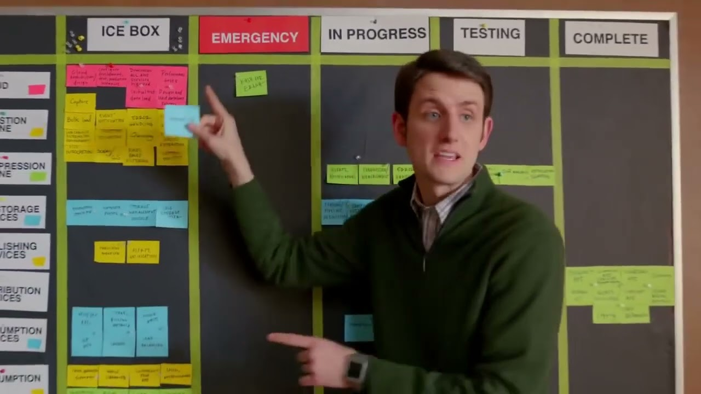
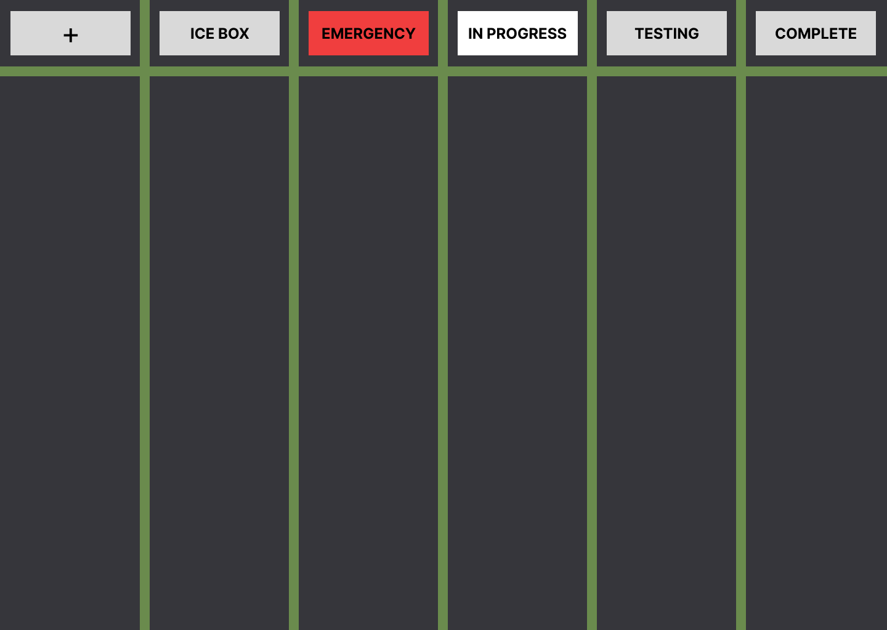

## Inspiration

Inspired by the scrum board scene in **HBO's Silicon Valley** (Season 1, Episode 5), where Jared introduces the Pied Piper team to agile development with a colorful sticky-note board. Built as a React learning project to recreate that experience in the browser.

> _"And that, gentlemen, is scrum. Welcome to the next eight weeks of our lives."_ — Jared



---

# Scrum Board

A drag-and-drop task management board built with React. Organize your tasks across columns and move them between stages as work progresses.



---

## Features

- 📋 Five task columns — Ice Box, Emergency, In Progress, Testing, Done
- 🗒️ Create sticky notes with custom text, color, and category
- 🖱️ Drag and drop notes between columns
- 🎨 Color coded notes — Pink, Green, Yellow, Orange

---

## Built With

- React
- CSS (no UI library)
- HTML5 Drag and Drop API

---

## Concepts Practiced

- `useState` for managing notes and UI state
- Props and component composition
- Lifting state up
- Controlled inputs
- Conditional rendering
- Array methods — `filter`, `map`, `spread`
- HTML5 drag and drop events — `draggable`, `onDragStart`, `onDragOver`, `onDrop`
- `dataTransfer` for passing data between drag events
- Event handling — `preventDefault`, `stopPropagation`

---

## Getting Started

```bash
# Clone the repo
git clone https://github.com/YOUR-USERNAME/scrum-board.git

# Navigate into the project
cd scrum-board

# Install dependencies
npm install

# Start the dev server
npm run dev
```

---

## Project Structure

```
src/
├── components/
│   ├── Board.js
│   ├── Column.js
│   ├── Note.js
│   └── AddNote.js
├── index.css
└── App.js
```

---

## How to Use

1. Click the **+** column to open the new note form
2. Write your note, pick a color and a category
3. Click **Add to Scrum Board**
4. **Drag** any note and **drop** it onto another column to move it
